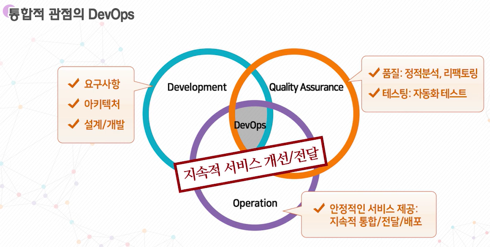

# 1주차 강의

> DevOps와 오픈소스 소프트웨어

## DevOps란?

* 기술과 시장의 빠른 변화에 대응하기 위한 최신 소프트웨어 개발/운영 트렌드 👉 소통, 협업, 통합의 서비스 중심
* 자주 빠르게 배포 / 낮은 실패율 / 빠른 복구 / 높은 품질 / 시스템 기반 자동화
* 오픈소스 소프트웨어 모델들이 성공하면서 공유와 협력 기반의 오픈소스 커뮤니티 활성화 👉 기업의 비용절감과 효율성을 제고

## 오픈소스 소프트웨어

소스코드를 공개하여 특별한 제한 없이 사용 가능한 소프트웨어

* 오픈소스라이센스: 오픈소스 소프트웨어 이용에 대한 조건을 규정한 것