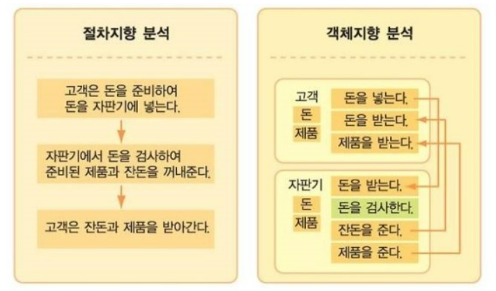

# 01.27_OOP

---

> `Object-Oriented Programming`의 약자로 `객체지향프로그래밍`이다.

## 쉽게 말해

> 주어 동사 형태로 프로그래밍하는 것!

## 1. 절차 지향 프로그래밍

> 물이 위에서 아래로 흐르듯 순차적인 처리가 중요합니다. 프로그램 전체가 유기적으로 연결되도록 만드는 프로그래밍 기법입니다.

## 2. 객체 지향 프로그래밍

>실제 세계를 모델링해 소프트웨어를 개발하는 방법입니다. 객체지향 프로그래밍에서는 데이터와 절차를 하나의 덩어리로 묶어서 생각합니다. 마치 컴퓨터 부품을 하나씩 구매해 컴퓨터를 조립하는 것과 같은 방식입니다.

