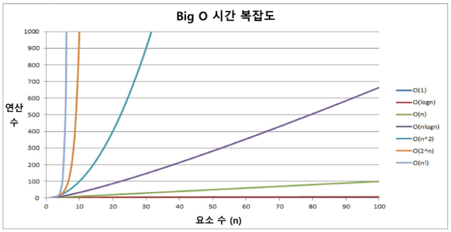
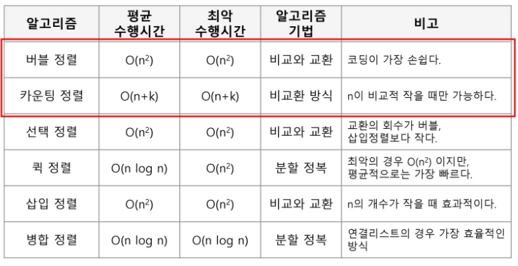
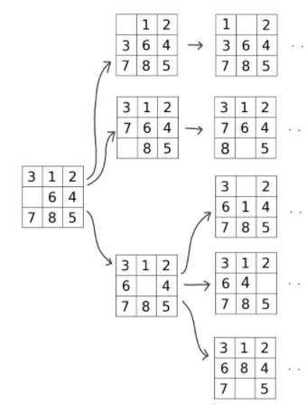
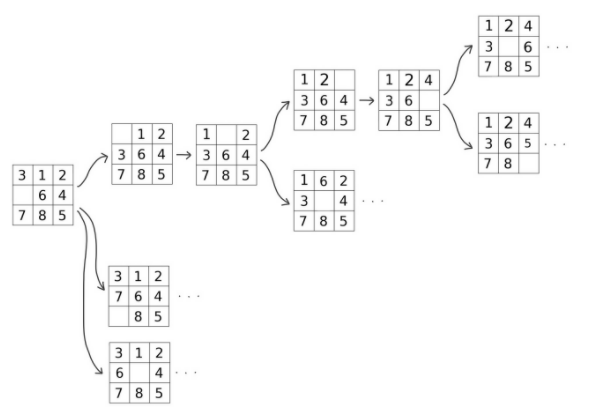
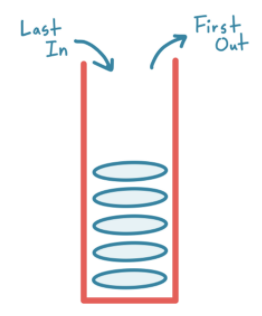
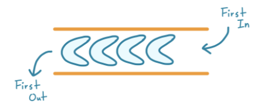
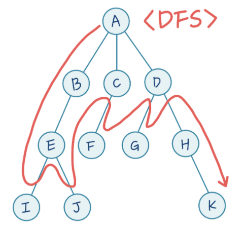
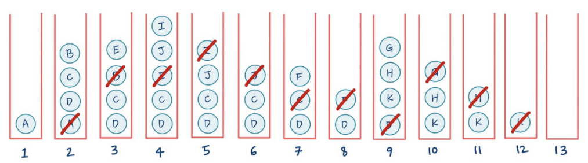
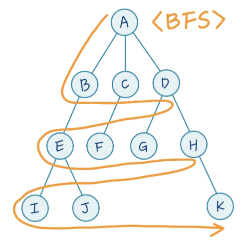
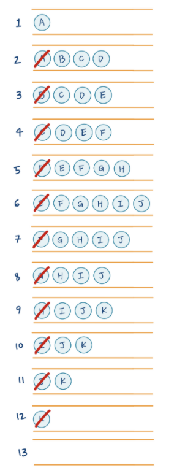

# Algorithm

> SW문제해결 algorithm 기본 이론

## Big-Oh Notation

> 시간 복잡도 함수 중에서 가장 큰 영향력을 주는 n에 대한 항만을 표시

## 배열

> 일정한 자료형의 변수들을 하나의 이름으로 열거하여 사요하는 자료구조

## 완전검색(Brute-force)

> 완전 검색 방법은 문제의 해법으로 생각할 수 있는 모든 경우의 수를 나열해보고 확인하는 기법

## 정렬 알고리즘

> 학습한 정렬 알고리즘의 특성

## 너비우선탐색(BFS) 👉 큐(queue)

> 매 단계에서 가능한 경우의 수들을 모두 확인하면서 탐색, 트리를 넓히면서 탐색하는 알고리즘

## 깊이우선탐색(DFS) 👉 스택(stack)

> 여러 경우의 수 중 하나를 선택, 선택 후 가능한 여러 경우의 수 중 하나를 선택
>
> 매 단계에서 가능한 것 중 일단 하나를 선택해 끝을 볼 때까지 확인

## 스택(Stack)

> 자료를 차곡차곡 쌓는 것
>
> Last In First Out 👉 후입선출

## 큐(Queue)

> 줄을 서서 기다리는 것
>
> First In First Out  👉 선입선출

## 구현 순차

### DFS - 깊이우선탐색

> 1. 루트 노드 (시작점) 인 `A` 를 스택에 넣습니다.
> 2. `A` 를 `Pop` 하면서 `Expand` 합니다. 즉, `A` 는 지우고 `A` 의 자식인 `B`, `C`, `D` 를 스택에 넣습니다.
> 3. 스택의 맨 위에 있는 `B` 를 `Pop` and `Expand` 합니다. 즉, `B` 는 지우고 `B` 의 자식인 `E` 를 스택에 넣습니다.
> 4. 스택의 맨 위에 있는 `E` 를 `Pop` and `Expand` 합니다. 즉, `E` 는 지우고 `E` 의 자식인 `I`, `J` 를 스택에 넣습니다.
> 5. 스택의 맨 위에 있는 `I` 를 `Pop` and `Expand` 합니다. 이 때, `I` 는 자식이 없으므로 (끝에 도달했으므로) 스택에 넣을 것이 없습니다.
> 6. 스택의 맨 위에 있는 `J` 를 `Pop` and `Expand` 합니다. 이 때, `J` 또한 자식이 없으므로 스택에 넣을 것이 없습니다.
> 7. 스택의 맨 위에 있는 `C` 를 `Pop` and `Expand` 합니다. 즉, `C` 는 지우고 `C` 의 자식인 `F` 를 스택에 넣습니다.
> 8. 스택의 맨 위에 있는 `F` 를 `Pop` and `Expand` 합니다. 이 때, `F` 는 자식이 없으므로 스택에 넣을 것이 없습니다.
> 9. 스택의 맨 위에 있는 `D` 를 `Pop` and `Expand` 합니다. 즉, `D` 는 지우고 `D` 의 자식인 `H`, `K` 를 스택에 넣습니다.
> 10. 스택의 맨 위에 있는 `G` 를 `Pop` and `Expand` 합니다. 이 때, `G` 는 자식이 없으므로 스택에 넣을 것이 없습니다.
> 11. 스택의 맨 위에 있는 `H` 를 `Pop` and `Expand` 합니다. 이 때, `H` 는 자식이 없으므로 스택에 넣을 것이 없습니다.
> 12. 스택의 맨 위에 있는 `K` 를 `Pop` and `Expand` 합니다. 이 때, `K` 는 자식이 없으므로 스택에 넣을 것이 없습니다.
> 13. 스택이 비었습니다. 이 말은 모든 노드를 탐색했다는 뜻이죠!

### BFS - 너비우선탐색

>1. 루트 노드 (시작점) 인 `A` 를 큐에 넣습니다.
>2. `A` 를 `Dequeue` 하면서 `Expand` 합니다. 즉, `A` 는 지우고 `A` 의 바로 다음 자식인 `B`, `C`, `D`를 큐의 오른쪽에 넣습니다.
>3. 큐의 맨 왼쪽에 있는 B 를 `Dequeue` and `Expand` 합니다. 즉, B 는 지우고 B 의 바로 다음 자식인 E 만 큐에 넣습니다.
>4. 큐의 맨 왼쪽에 있는 `C` 를 `Dequeue` and `Expand` 합니다. 즉, `C` 는 지우고 `C` 의 바로 다음 자식인 `F` 를 큐에 넣습니다.
>5. 큐의 맨 왼쪽에 있는 `D` 를 `Dequeue` and `Expand` 합니다. 즉, `D` 는 지우고 `C` 의 바로 다음 자식인 `G`, `H` 를 큐에 넣습니다.
>6. 큐의 맨 왼쪽에 있는 `E` 를 `Dequeue` and `Expand` 합니다. 즉, `E` 는 지우고 `E` 의 바로 다음 자식인 `I`, `J` 를 큐에 넣습니다.
>7. 큐의 맨 왼쪽에 있는 `F` 를 `Dequeue` and `Expand` 합니다. 이 때, `F` 는 자식이 없으므로 큐에 넣을 것이 없습니다.
>8. 큐의 맨 왼쪽에 있는 `G` 를 `Dequeue` and `Expand` 합니다. 이 때, `G` 는 자식이 없으므로 큐에 넣을 것이 없습니다.
>9. 큐의 맨 왼쪽에 있는 `H` 를 `Dequeue` and `Expand` 합니다. 즉, `H` 는 지우고 `H` 의 바로 다음 자식인 `K` 를 큐에 넣습니다.
>10. 큐의 맨 왼쪽에 있는 `I` 를 `Dequeue` and `Expand` 합니다. 이 때, `I` 는 자식이 없으므로 큐에 넣을 것이 없습니다.
>11. 큐의 맨 왼쪽에 있는 `J` 를 `Dequeue` and `Expand` 합니다. 이 때, `J` 는 자식이 없으므로 큐에 넣을 것이 없습니다.
>12. 큐의 맨 왼쪽에 있는 `K` 를 `Dequeue` and `Expand` 합니다. 이 때, `K` 는 자식이 없으므로 큐에 넣을 것이 없습니다.
>13. 큐가 비었습니다. 모든 노드를 탐색했다는 뜻이죠!