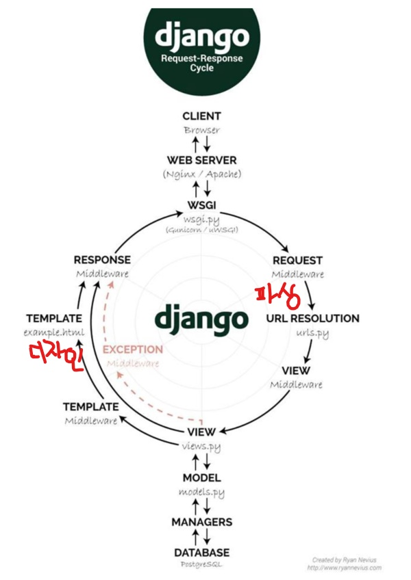

# Django wep programming

>파이썬으로 만들어진 무료 오픈소스 웹 애플리케이션 프레임워크
>
>즉, 쉽고 빠르게 웹사이트를 개발할 수 있도록 돕는 구성요소로 이루어진 웹 프레임워크
>
>여기서 프레임워크란, 애플리케이션 개발에 바탕이 되는 템플릿과 같은 역할을 하는 클래스들과 인터페이스의 집합

## 기본 생성 파일

* mysite: 프로젝트를 담는 공간
* manage.py: 프로젝트와 다양한 방법으로 상호작용 하는 커맨드라인의 유틸리티
* init.py: 파이썬으로 하여금 이 디렉토리를 패키지처럼 다루라고 알려주는 용도의 빈 파일
* setting.py: 현재 프로젝트의 환경 및 구성을 저장
* urls.py: 현재 프로젝트의 URL선언을 저장
* wsgi.py: 현재 프로젝트를 서비스하기 위한 WSGI 호환 웹 서비의 진입점

## django cycle



## django 명령어

```python
# 서버가 제대로 동작하는지 로컬에서 확인, http://127.0.0.1:8000/에서 출력
$ python manage.py runserver

# 앱 생성
$ python manage.py startapp 앱명
```

## 프로젝트와 앱

* 앱: 특정한 기능을 수행하는 웹 어플리케이션, 다수의 프로젝트에 포함될 수 있다.
* 프로젝트: 특정 웹 사이트를 위한 앱들과 각 설정들을 한데 묶어놓은 것, 다수의 앱을 포함할 수 있다.

## 작동 순서

1. view 내용 입력
2. 뷰를 호출하기 위한 연결 url 생성을 위해 `urls.py` 파일 생성
3. 최상위 URLconf에서 생성한 `urls.py`모듈을 바라보게 설정
   * 이때 `include()`함수는 다른 URLconf드을 참조할 수 있도록 도움
   * 만약 `127.0.0.1/polls/`이라는 url을 받으면 파싱을 하여 분기, 해당 path인 `polls`을 잡아내고 연결을 시켜줌
   * 연결된 `urls.py`에서 path를 통해 `view`로 연결
   * `view`내부의 함수를 통해 `response`를 클라이언트에게 전달