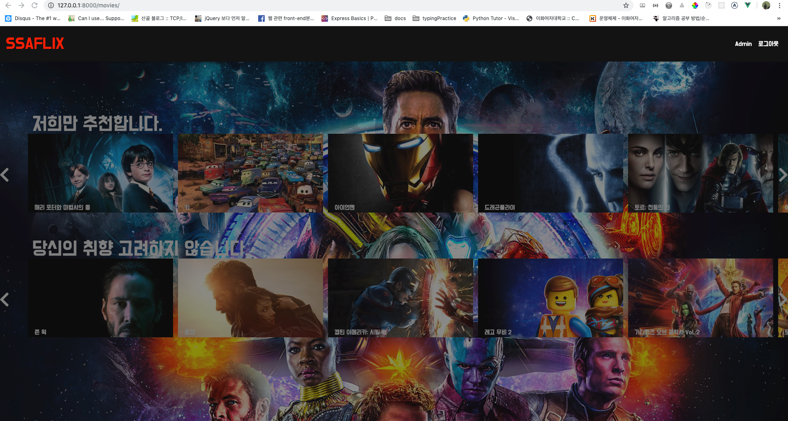

#  SSAFLIX


###### 2019 05. 13 ~ 2019 05. 17
## 1. 팀원 정보 및 업무 분담 내역

* 김도우 - 프론트엔드 담당
  * CSS, Bootstrap4, Vue.js 및 핵심적인 UI 구현
* 오진석 - 백엔드 담당
  * Django API Server, API를 활용한 Data Seeding 구현


## 2 목표

* SSAFY 1학기 최종 프로젝트
* 영화 추천 서비스 구현
* Vue.js 와 Django를 활용한 서비스 설계
* Netflix 를 기반으로한 클론 코딩
* Git 을 통한 소스코드 버전 관리 및 협업
* Netflix를 기반으로 최대한 비슷하게 클론 코딩을 진행하려고 함.
  * UI의 경우 transition과 animation을 제외하면 상당히 유사한 정도라 생각함.
  * 그러나 CSS에서 속성값 설정시 반응형을 고려하지 않고, OS와. Browser를 고려하지 않고 Mac OS 또는 Window 환경의 Chrome 에서 진행되었다.


## 3. 개발환경

* Python
  * Python 3.6.7
  * django 2.1.8
* Javscript
  * ECMA5 +
  * Vue.js
* Database
  * sqlite3

## 4. 개요

1. 본 서비스는 TMDB API를 활용하여 데이터를 수집, 가공하여 데이터 베이스에 저장하였다.
2. 웹서비스를 위주로 반응형 웹은 고려하지 않았으며, 최신 UI 기술 도입에 초점을 두었다.
3. Django REST Framework를 활용하여 URL 렌더링 및 기본 템플릿을 사용하였으며 메인 기능은 하나의 페이지에서 Vue.js 를 사용, SPA 유사하게 구현하였다.
4. github를 활용하여 소스코드 버전 관리를 진행하였으며 그 주소는 <https://github.com/dowookims/ssafy_movie> 이다.
5. 영화 추천의 경우 주어진 영화와 비슷한 영화를 추천하는 방식으로 설계되었다
6. 프로젝트 폴더 구성

```
├── README.md
├── account
│   ├── admin.py
│   ├── apps.py
│   ├── forms.py
│   ├── migrations
│   ├── models.py
│   ├── templates
│   │   └── account
│   │       ├── detail.html
│   │       ├── login.html
│   │       ├── password.html
│   │       ├── signup.html
│   │       └── update.html
│   ├── tests.py
│   ├── urls.py
│   └── views.py
├── api
│   | ── admin.py
│   ├── apps.py
│   ├── migrations
│   ├── models.py
│   ├── serializers.py
│   ├── tests.py
│   ├── urls.py
│   └── views.py
├── db.sqlite3
├── manage.py
├── movie
│   ├── admin.py
│   ├── apps.py
│   ├── fixtures
│   │   ├── credits.json
│   │   ├── genre.json
│   │   └── movie1.json
│   ├── migrations
│   ├── models.py
│   ├── serializers.py
│   ├── static
│   │   └── movie
│   │       ├── css
│   │       │   └── index.css
│   │       └── js
│   │           ├── comment.js
│   │           ├── main.js
│   │           └── recommend.js
│   ├── templates
│   │   └── movie
│   │       └── index.html
│   ├── tests.py
│   ├── urls.py
│   └── views.py
├── requirements.txt
├── ssafy_movie
│   ├── settings.py
│   ├── urls.py
│   └── wsgi.py
├── static
│   └── css
│       └── index.css
├── templates
│   ├── base.html
│   ├── footer.html
│   ├── main.html
│   └── nav.html

```

7. 데이터베이스 모델링


## 5. 핵심 기능

* 웹 어플리케이션 처음 진입시 영상 자동 재생.
* Netflix 비슷한 UI로 구현하였다.
* Vue component 를 활용하여 재사용 할 수 있는 웹 어플리케이션 제작

## 6. 느낀점

* 김도우

  Vue를 쓸 때 컴포넌트를 구성하고, 작업하는데 많은 어려움을 느꼈습니다. 부모 요소의 정보를 자식에게 전달하거나, 렌더링시 이를 고려하는게 복잡해서 생각보다 많은 시간을 쓰게 되었는데, 추후 이 부분을 보강해야 할 것 같습니다. 또한 CSS의 경우 transition 과 animation 이 복잡해서 충분히 구현하지 못했다는게 아쉽습니다. 그러나 position과 배치에 대해 많은 고민과 경험을 해봐서 정말 다행이라 생각합니다.

* 오진석

  Single 페이지로 웹사이트를 제작하다보니 어려운 점이 많았지만, 프로그램의 구조에 대해서 생각해볼 수 있는 좋은 경험이었습니다. Back-end에서 서버를 잘 제작해야 사용자에게 좋은 정보를 전달할 수 있다는 것도 느꼈습니다. 웹의 처음부터 끝까지 제작하면서 쉬운 것이 하나도 없다는 것을 느꼈습니다. 다음에는 충분한 시간을 가지고 설계를 해서 잘 만들어보고 싶습니다.
