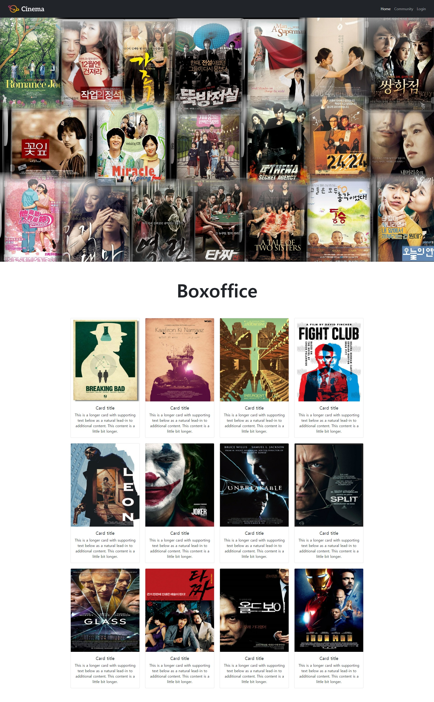
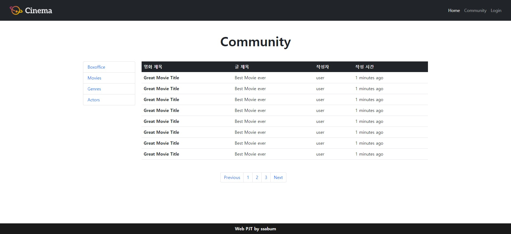

# Cinema page_21.02.07

> SSAFY 프로젝트로 진행했던 영화 홈페이지 만들기를 완성시키지 못했다...😅
>
> 이후 다시 한번 제대로 차근차근 홈페이지를 만들어 가보자!

## 프로젝트 개요

> 기본적인 영화 정보 홈페이지를 HTML과 CSS, BOOTSTRAP을 이용하여 제작

## 프로젝트 환경

```python
# 개발 환경
OS : window
Language : python
IDE : visual studio

# Web
HTML
CSS
Bootstrap
```

## 프로젝트 내용

### Main page

> 아래 이미지는 메인 페이지로서 Viewport의 가로 길이에 따라 노출되는 영화카드의 개수가 달라진다!



### Community page

> 커뮤니티 페이지로 Viewport의 가로 길이애 따라 컨텐츠들의 사이즈와 구성이 변화한다!



## 총평

> `Bootstrap`을 사용하여 보다 편리하고 빠르게 웹페이지를 제작할 수 있었다,
>
> 시간을 들여 천천히 생각하면서 프로젝트를 진행한 끝에, `Bootstrap`에서 제공하는 `template`코드들을 이해하고 내가 원하는 방향으로 수정을 할 수 있게 되었으며
>
> 내가 원하는 디자인이 적용이 안 될 때 개발자 도구를 통해 확인함으로써 원인과 해결방안을 고려할 수 있었다. 👍
>
> 이후에는 `Bootstrap`을 사용하지 않고 처음부터 끝까지 만들어보는 기회를 가져야 겠다고 생각했다.😏