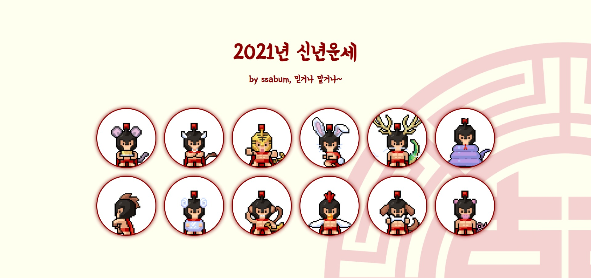
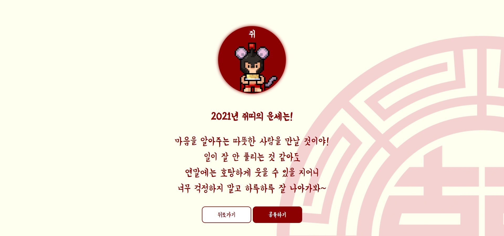
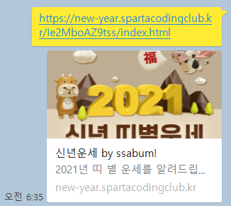

# 신년운세 page_21.02.14

> 띠별로 신축년 새해 신년운세를 확인해보자!😎
>
> `스파르타코딩클럽`의 수업을 따라가며 내손으로 제작부터 배포까지

## 프로젝트 개요

> 신년운세를 띠별로 알려주는 페이지를 `HTML`, `CSS`, `JAVAscript`를 이용하여 제작하여 배포해본다.

## 프로젝트 환경

```python
# 개발 환경
OS : window
Language : python
IDE : visual studio

# Web
HTML
CSS
JAVAscript
```

## 프로젝트 내용

### Main page

> 동양풍이 느껴지는 디자인의 메인 페이지로 십이간지의 동물별로 해당 띠를 선택하면 각각의 운세를 확인할 수 있는 페이지로 이동한다.
>
> 반응형으로 만들어서 `viewport`의 크기에 따라 동물들이 있는 원의 개수가 조정된다.



### Result page

> 십이간지 동물별로 운세를 확인할 수 있는 결과페이지이다.
>
> `뒤로가기`버튼을 누르면 `main page`로 이동하며, `공유하기`버튼을 누르면 링크가 복사된다.



### 배포

> `스파르타코딩클럽`에서 제공하는 서비스를 이용하여 배포하여 링크를 생성하였다.
>
> [2021 신년 띠별운세 by ssabum](https://new-year.spartacodingclub.kr/Ie2MboAZ9tss/index.html) 👈 내가 만든 사이트 주소



## 총평

> `스파르타코딩클럽`의 수업을 따라가며 간단히 제작하고 배포해본 프로젝트이다.
>
> 간단하면서도 직관적이고 흥미로운 사이트를 만들어 볼 수 있었다.
>
> 보다 자세히 `JAVAscript`와 `배포`과정을 학습할 수 있었으면 좋았을 것 같다...👈 내가 직접 공부해서 알아보는 걸로...
>
> 무엇보다, 배포를 통해 내가 만든 사이트를 남들에게 보여줄 수 있는 것이 가장 좋았다!! 😏